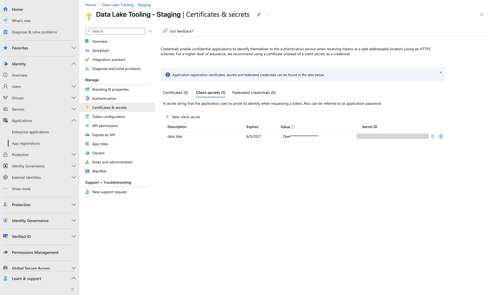
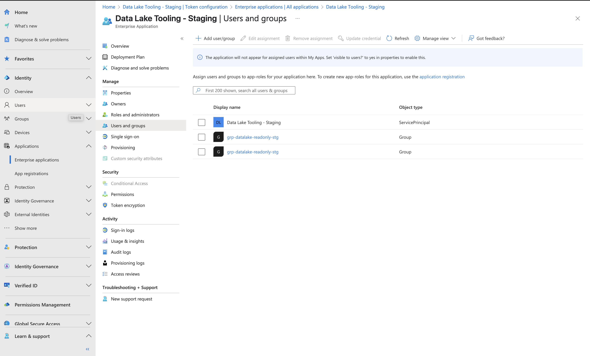

# Nessie Auth Via Microsoft Entra

### Preamble
Let's just start by saying _Microsoft Entra_ is not the most... intuitive of identity providers. The documentation is cryptic, fragmented and often incorrect. The patterns and endpoints are mixed with remnants of Active Directory and quite often the only way to figure out implementation details is a lot of trial and error. This demo attempts to lay out a common set of use cases with enough breadcrumbs that if/when your needs differ, you hopefully do not need to go too far off the path to get things working the way you want.

## Assumptions
- You are using an enterprise Azure account for your IDP (because you are authenticating for a company).
- You are running a your lakehouse in AWS via S3 and ECS.
- Authentication should be restricted to members of that enterprise (only people in the company may access company data in your data lakehouse).
- Both humans and applications (ie EL scripts, downstream tools etc) will need access to your data lakehouse.
- You want to control authorization (i.e. _who_ can do _what_) via Groups in Azure (this is usually the case if your organization is using Entra as an IDP).
- Your human users will be running programs locally, such as local instances of Dremio or Jupyter Notebooks. Your programmatic users will either be local or inside the VPC.
- Your Nessie endpoint is either exposed publicly, or inside a private VPN along with all clients.

## Setting up the App in Entra
All OIDC (openid) and authorization functions require an App in Entra to work. Start by navigating to [App Registrations](https://entra.microsoft.com/#view/Microsoft_AAD_RegisteredApps/ApplicationsListBlade/quickStartType~/null/sourceType/Microsoft_AAD_IAM?Microsoft_AAD_IAM_legacyAADRedirect=true) and create a new app - we called ours **Data Lake Tooling** in this demo. This will bring you to your app overview.

From here, set up the redirect URI; this is the localhost endpoint lock-nessie will use to perform the authentication flow and log your users in.

Now you need to add App Roles. Without getting into all the convoluted hierarchies in Entra, App Roles are a way of creating access that only applies to your application (in this case, Data Lakehouse access). We will create a pair of roles, `DataLakeServiceRole` and `DataLakeMainReadOnly` with values of `main.All` and `main.Read`.

>[!Note]
> It doesn't matter what you name these roles, or what values you give them, as long as they make sense to you and your org. You will need to reference them
> both in groups and in the CEL rules you apply to Nessie to grant/deny them access. We went with `main.All` and `main.Read` here, because the branch
> we care about is named `main`. YMMV.

For programmatic (script) access, you will also need a _secret_. This allows OIDC to complete a login without a human appoving the authentication.
Navigate to the credentials and secrets blade, and set one up. You will actually be authenticating as this application (the one you are creating right now), so you'll need to give this application access to the roles it needs to act on.. itself. When you create this secret be sure to save it (you can't see it again later).

Now, you need to assign the App Roles to the application (yes, this is ridiculous). To do this, go to the Enterprise Applications screen and follow those instructions.

With the application assigned to the new roles, you now want to assign roles to users. However, most organizations use _Groups_ for authorization, not roles. To keep your IT team from hating you, you will want to:
- create a group for data lakehouse read-only access
- assign the read-only role to that group
- assign the read-only group to users

This way a new team member that is onboarded can be added to the read-only group along with 100 other groups (like your Jira or Monday or Sharepoint or whatever) in exactly the same way.

Start by creating a group named with the same pattern your company already uses:

Assign the role to the group you just created. Then assign the group to the user(s) you want to have read-only access. You can also assign a group to another group (say, if everyone should have read access to the data lakehouse, maybe assign the read only group to the `all-users` group).

But here's the rub. Human users are assigned their groups (like the one you just assigned) in the `groups` JWT claim. This is good - Nessie is, by default, looking for authentication roles in the `groups` claim (no, that is not intuitive naming, but it is the convention). Applications, however, do not get a groups claim, even if you explicitly assign it to the `access_token` JWT. So for Nessie auth to work with both human and application (script) authorization, we need to:

1. Force an extra claim `roles` in both id and access tokens.
2. Populate the roles via groups (like we did above).
3. Update Nessie to look for groups in `roles` instead.

To do this, you can directly edit the [manifest.json](manifest.json) (in the manifest tab of the app overview) or set it up via optional claims under the "Token configuration" tab. I found that the manifest editing was the only way to make it work, but others have reported that the GUI flow worked for them.

At this point you are ready to copy all the things you need:

- The `client_id` and `tenant_id` can be found on the app overview page.
- The `client_secret` is the secret value you saved earlier.

## Setting up the Server
Using the [docker-compose.yml](../../docker-compose.yml) in this repo as an example, populate an .env file at the root with the values you just captured from the Entra screen.
You can now spin up the compose stack and open your notebook, which will allow you to auth as a human and read things fron Nessie! You can also check out the [script](../../el_script.py) which authed as a robot and wrote things to Nessie.